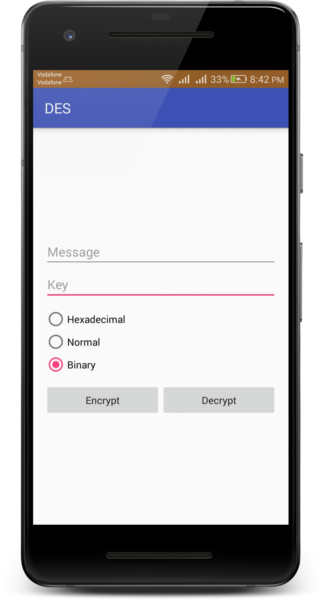
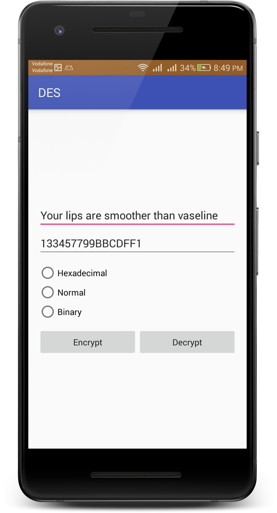
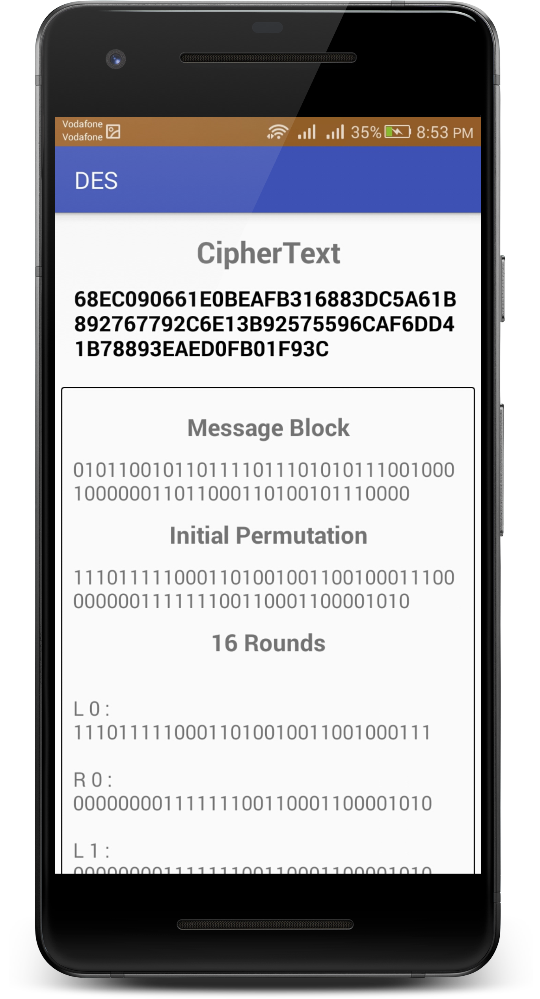
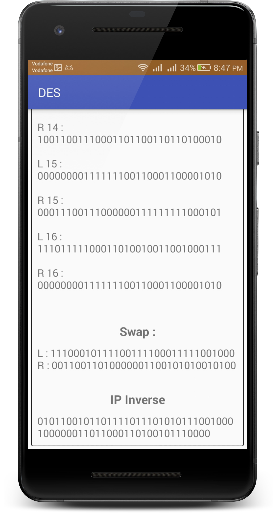
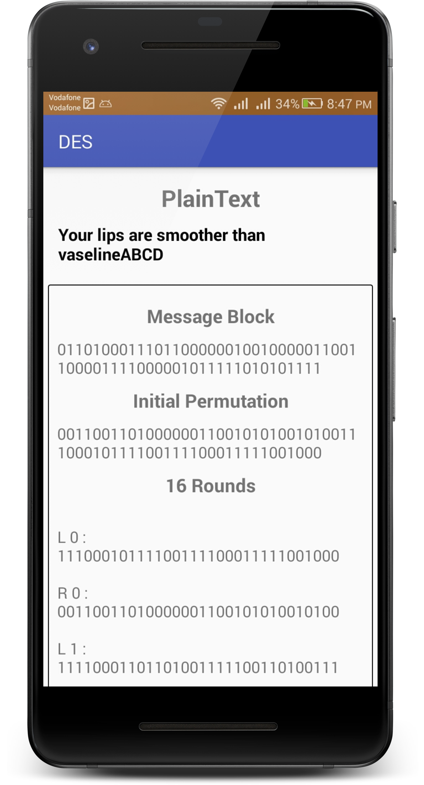

# Des-Encryption

## Description

DES is an encryption and decryption Algorithm

you could find DES descriptin <a href="https://goo.gl/XcVN8Z">here</a>

`View` Package contain all the interaction views
`Model` Package contains all the DES algorithm, functions and logic

The App will start with a sample of plain text and a sample key if you want to test the algorithm
## Features:
- Encrypt plain texts via a key and get the decrypted cipher text.
- Decrypt cipher texts via a Key and get the original plain text.

## Libraries and Tools
- simple android TextView and RecyclerView.
- naming conventions will help you understand what every line of code's functionality.

## Screenshots

  <br>
  <br>


## License

* [Apache Version 2.0](http://www.apache.org/licenses/LICENSE-2.0.html)

```
Copyright 2018 Ali Ussama

Licensed under the Apache License, Version 2.0 (the "License");
you may not use this file except in compliance with the License.
You may obtain a copy of the License at

 http://www.apache.org/licenses/LICENSE-2.0

Unless required by applicable law or agreed to in writing, software
distributed under the License is distributed on an "AS IS" BASIS,
WITHOUT WARRANTIES OR CONDITIONS OF ANY KIND, either express or implied.
See the License for the specific language governing permissions and
limitations under the License.
```
